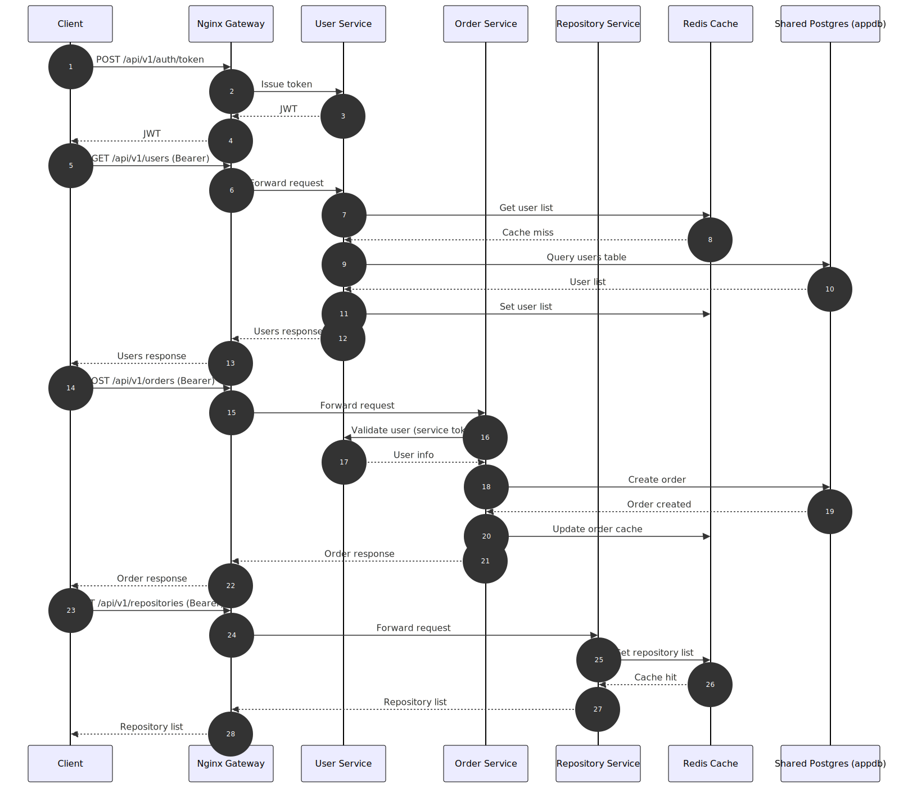

# Enterprise Microservice System

A production-ready, enterprise-grade microservice system built with Go, featuring clean architecture, comprehensive observability, and industry-standard patterns.

## Table of Contents

- [Architecture Overview](#architecture-overview)
- [Tech Stack](#tech-stack)
- [Project Structure](#project-structure)
- [Features](#features)
- [Getting Started](#getting-started)
- [Configuration](#configuration)
- [API Documentation](#api-documentation)
- [Testing](#testing)
- [Development](#development)
- [Deployment](#deployment)
- [Monitoring](#monitoring)

## Architecture Overview

This system follows a **microservice architecture** with clean separation of concerns. A Vue.js portal is served through an Nginx gateway that also routes API traffic to backend services:

```
┌───────────────────────┐
│ Vue Portal + Nginx    │  Port: 8080
└───────────┬───────────┘
            │
   ┌────────▼────────┐   ┌────────▼────────┐   ┌────────▼────────────┐
   │   User Service  │   │  Order Service  │   │ Repository Service  │
   │   Port: 8081    │◄──┤   Port: 8082    │   │   Port: 8083        │
   └────────┬────────┘   └────────┬────────┘   └────────┬────────────┘
            │                    │                     │
       ┌────▼────┐          ┌────▼────┐          ┌──────▼────────┐
       │ User DB │          │ Order DB│          │ Repository DB │
       └─────────┘          └─────────┘          └───────────────┘
            └───────────────┬───────────────┬───────────────┘
                            ▼
                      ┌────────────┐
                      │ Redis Cache│
                      │  Port 6379 │
                      └────────────┘
                            │
       ┌────────────────────▼────────────────────┐
       │             Prometheus Metrics          │
       └─────────────────────────────────────────┘
```



### Key Architectural Decisions

- **Clean Architecture**: Each service follows the clean architecture pattern with clear separation between transport, service, domain, and repository layers
- **Microservice Independence**: Each service has its own database (database-per-service pattern)
- **Circuit Breaker**: Order service uses circuit breaker pattern for resilient communication with user service
- **Graceful Degradation**: Services continue operating even when dependencies are unavailable
- **Observability First**: Comprehensive logging, metrics, and health checks built-in

## Tech Stack

| Component | Technology |
|-----------|-----------|
| Language | Go 1.23 |
| HTTP Framework | Gin |
| ORM | GORM |
| Database | PostgreSQL 16 |
| Cache | Redis 7 |
| Migrations | golang-migrate |
| Authentication | JWT (golang-jwt/jwt) |
| Logging | Zap (structured logging) |
| Metrics | Prometheus |
| Circuit Breaker | gobreaker |
| Rate Limiting | golang.org/x/time/rate (token bucket) |
| API Docs | Swagger (swaggo) |
| Frontend | Vue 3 + Vite |
| Gateway | Nginx |
| Containerization | Docker, Docker Compose |
| Hot Reload | Air |

## Project Structure

```
enterprise-microservice-system/
├── .github/                        # GitHub workflows
│   └── workflows/
│       └── ci.yml                  # CI: tests + link checks
├── common/                          # Shared libraries
│   ├── auth/                       # JWT utilities
│   ├── cache/                      # Redis cache helpers
│   ├── circuitbreaker/             # Circuit breaker implementation
│   ├── errors/                     # Custom error types
│   ├── logger/                     # Structured logging
│   ├── metrics/                    # Prometheus metrics
│   ├── middleware/                 # HTTP middleware
│   │   ├── cors.go                # CORS handling
│   │   ├── logger.go              # Request logging
│   │   ├── rate_limiter.go        # Token bucket rate limiter
│   │   ├── recovery.go            # Panic recovery
│   │   └── request_id.go          # Request ID tracking
│   └── response/                   # Standard API responses
├── services/
│   ├── user-service/              # User management service
│   │   ├── cmd/
│   │   │   ├── main.go           # Entry point
│   │   │   └── migrate/          # Migration runner
│   │   │       └── main.go
│   │   ├── internal/
│   │   │   ├── api/              # Route definitions
│   │   │   ├── config/           # Configuration
│   │   │   ├── handler/          # HTTP handlers
│   │   │   ├── model/            # Domain models
│   │   │   ├── repository/       # Data access layer
│   │   │   └── service/          # Business logic
│   │   ├── migrations/           # SQL migrations
│   │   ├── tests/                # Unit tests
│   │   ├── Dockerfile            # Container definition
│   │   ├── .air.toml             # Hot reload config
│   │   └── docs/                 # Swagger docs (generated)
│   └── order-service/            # Order management service
│       ├── cmd/
│       │   ├── main.go           # Entry point
│       │   └── migrate/          # Migration runner
│       │       └── main.go
│       ├── internal/
│       │   ├── api/              # Route definitions
│       │   ├── client/           # Inter-service communication
│       │   ├── config/           # Configuration
│       │   ├── handler/          # HTTP handlers
│       │   ├── model/            # Domain models
│       │   ├── repository/       # Data access layer
│       │   └── service/          # Business logic
│       ├── migrations/           # SQL migrations
│       ├── Dockerfile            # Container definition
│       ├── .air.toml             # Hot reload config
│       └── docs/                 # Swagger docs (generated)
│   └── repository-service/       # Repository management service
│       ├── cmd/
│       │   ├── main.go           # Entry point
│       │   └── docs.go           # Swagger metadata
│       ├── internal/
│       │   ├── api/              # Route definitions
│       │   ├── config/           # Configuration
│       │   ├── handler/          # HTTP handlers
│       │   ├── model/            # Domain models
│       │   ├── repository/       # Data access layer
│       │   └── service/          # Business logic
│       ├── tests/                # Unit tests
│       ├── Dockerfile            # Container definition
│       └── docs/                 # Swagger docs (generated)
├── monitoring/
│   └── prometheus.yml            # Prometheus configuration
├── docs/                          # API tooling and docs assets
│   ├── HLD.md
│   ├── hld-diagram.svg
│   └── collections/
│       ├── enterprise-microservice-system.postman_collection.json
│       └── enterprise-microservice-system.postman_environment.json
├── frontend/                       # Vue.js portal (SPA)
│   ├── src/
│   ├── Dockerfile
│   └── nginx.conf
├── docker-compose.yml            # Container orchestration
├── .lychee.toml                   # Link checker configuration
├── Makefile                      # Build and run commands
├── go.mod                        # Go dependencies
├── .env.example                  # Environment variables template
└── README.md                     # This file
```

### Layer Responsibilities

1. **Handler Layer**: Receives HTTP requests, validates input, calls service layer, returns HTTP responses
2. **Service Layer**: Contains business logic, orchestrates operations, handles transactions
3. **Repository Layer**: Handles database operations, implements data access patterns
4. **Model Layer**: Defines domain entities and data transfer objects

## Features

### 1. CRUD Operations
- Full RESTful APIs for users, orders, and repositories
- Repository Service manages repository metadata (name, owner, visibility, URL) with RBAC enforcement
- Request validation using Gin's validator
- Pagination and filtering support
- Soft delete functionality

### 2. Database Management
- PostgreSQL with GORM ORM
- Versioned migrations with golang-migrate
- Embedded migration runner on service startup
- Connection pooling
- Transaction support
- Separate databases per service

### 3. Authentication & Authorization
- JWT-based authentication
- Role-based access control (admin/user/service)
- Service-to-service tokens for internal calls

### 4. Portal & Gateway
- Vue.js enterprise portal for operations and observability
- Nginx gateway serving the SPA and routing API traffic
- Unified access to `/api`, `/health`, `/metrics`, and `/swagger`

### 5. Rate Limiting
- Token bucket algorithm implementation
- Per-IP rate limiting
- Configurable limits
- Thread-safe using sync.Map

### 6. Circuit Breaker
- Protects inter-service calls
- States: Closed, Half-Open, Open
- Configurable failure threshold
- Automatic recovery attempts
- Graceful fallback responses

### 7. Concurrency Features
- Goroutines for background tasks
- Worker pool pattern
- Mutex for thread-safe operations
- Channel-based communication
- Context-aware request handling

### 8. Metrics & Observability
- Prometheus-compatible metrics endpoint
- Request count, latency, error rate tracking
- Circuit breaker state monitoring
- Health check endpoints
- Structured JSON logging

### 9. Middleware Stack
- CORS handling
- Request ID generation
- Panic recovery
- Request logging
- Rate limiting
- Metrics collection

### 10. Caching
- Redis-backed cache for read-heavy endpoints
- Configurable TTL per service
- Safe cache fallbacks when Redis is unavailable

### 11. Developer Experience
- Hot reload with Air
- Comprehensive Makefile
- Docker Compose for local development
- Environment variable configuration
- Clear error messages

## Getting Started

### Prerequisites

- Go 1.23 or later
- Docker and Docker Compose
- Make (optional but recommended)
- PostgreSQL (if running locally without Docker)

### Quick Start with Docker

1. Clone the repository:
```bash
cd enterprise-microservice-system
```

2. Copy environment variables:
```bash
cp .env.example .env
```

3. Start all services with Docker Compose:
```bash
make docker-up
```

This will start:
- User Service (http://localhost:8081)
- Order Service (http://localhost:8082)
- Repository Service (http://localhost:8083)
- Web Portal + Gateway (http://localhost:8080)
- Redis (localhost:6379)
- PostgreSQL databases
- Prometheus (http://localhost:9090)

4. Verify services are running:
```bash
curl http://localhost:8081/health
curl http://localhost:8082/health
curl http://localhost:8083/health
curl http://localhost:8080/health/user
curl http://localhost:8080/health/order
curl http://localhost:8080/health/repository
```

5. Open the portal:
```
http://localhost:8080
```

6. Get an access token:
```bash
curl -X POST http://localhost:8080/api/v1/auth/token \
  -H "Content-Type: application/json" \
  -d '{
    "client_id": "admin",
    "client_secret": "admin123"
  }'
```

Use the returned token in the `Authorization` header for all protected endpoints:
```bash
curl http://localhost:8081/api/v1/users \
  -H "Authorization: Bearer <token>"
```

### Run & Test Endpoints

Health checks (via gateway):
```bash
curl http://localhost:8080/health/user
curl http://localhost:8080/health/order
curl http://localhost:8080/health/repository
```

Issue a token (via gateway):
```bash
curl -X POST http://localhost:8080/api/v1/auth/token \
  -H "Content-Type: application/json" \
  -d '{
    "client_id": "admin",
    "client_secret": "admin123",
    "roles": ["admin"]
  }'
```

User endpoints (via gateway):
```bash
curl -H "Authorization: Bearer <token>" http://localhost:8080/api/v1/users
curl -X POST http://localhost:8080/api/v1/users \
  -H "Content-Type: application/json" \
  -H "Authorization: Bearer <token>" \
  -d '{"email":"user@example.com","name":"User One","age":30}'
```

Order endpoints (via gateway):
```bash
curl -H "Authorization: Bearer <token>" http://localhost:8080/api/v1/orders
curl -X POST http://localhost:8080/api/v1/orders \
  -H "Content-Type: application/json" \
  -H "Authorization: Bearer <token>" \
  -d '{"user_id":1,"product_id":"PROD-1","quantity":1,"total_price":9.99}'
```

Repository endpoints (via gateway):
```bash
curl -H "Authorization: Bearer <token>" http://localhost:8080/api/v1/repositories
curl -X POST http://localhost:8080/api/v1/repositories \
  -H "Content-Type: application/json" \
  -H "Authorization: Bearer <token>" \
  -d '{"name":"repo-one","owner_id":1,"visibility":"private","url":"https://example.com/repo-one"}'
```

Metrics (via gateway):
```bash
curl http://localhost:8080/metrics/user
curl http://localhost:8080/metrics/order
curl http://localhost:8080/metrics/repository
```

Swagger UI (via gateway):
```
http://localhost:8080/swagger/user/
http://localhost:8080/swagger/order/
http://localhost:8080/swagger/repository/
```

### Local Development Setup

1. Install dependencies:
```bash
make deps
```

2. Install development tools:
```bash
make install-tools
```

3. Start databases:
```bash
docker-compose up -d user-db order-db repository-db
```

4. Run migrations (optional if you prefer manual control):
```bash
make migrate-user
make migrate-order
```

5. Run services locally:

In terminal 1:
```bash
make run-user
```

In terminal 2:
```bash
make run-order
```

In terminal 3:
```bash
make run-repository
```

Or run all services concurrently:
```bash
make run
```

### Frontend Development

```bash
cd frontend
npm install
npm run dev
```

The portal will be available at `http://localhost:5173` (dev) or `http://localhost:8080` (Docker + gateway).

### Hot Reload Development

```bash
# Terminal 1
make dev-user

# Terminal 2
make dev-order
```

## Configuration

### Environment Variables

#### User Service
| Variable | Description | Default |
|----------|-------------|---------|
| USER_SERVICE_PORT | HTTP port | 8081 |
| USER_SERVICE_DB_HOST | Database host | localhost |
| USER_SERVICE_DB_PORT | Database port | 5432 |
| USER_SERVICE_DB_USER | Database user | postgres |
| USER_SERVICE_DB_PASSWORD | Database password | postgres |
| USER_SERVICE_DB_NAME | Database name | userdb |
| USER_SERVICE_LOG_LEVEL | Log level (debug/info/warn/error) | info |
| USER_SERVICE_RATE_LIMIT | Requests per second | 100 |

#### Order Service
| Variable | Description | Default |
|----------|-------------|---------|
| ORDER_SERVICE_PORT | HTTP port | 8082 |
| ORDER_SERVICE_DB_HOST | Database host | localhost |
| ORDER_SERVICE_DB_PORT | Database port | 5432 |
| ORDER_SERVICE_DB_USER | Database user | postgres |
| ORDER_SERVICE_DB_PASSWORD | Database password | postgres |
| ORDER_SERVICE_DB_NAME | Database name | orderdb |
| ORDER_SERVICE_LOG_LEVEL | Log level | info |
| ORDER_SERVICE_RATE_LIMIT | Requests per second | 100 |
| ORDER_SERVICE_USER_SERVICE_URL | User service URL | http://localhost:8081 |

#### Repository Service
| Variable | Description | Default |
|----------|-------------|---------|
| REPOSITORY_SERVICE_PORT | HTTP port | 8083 |
| REPOSITORY_SERVICE_DB_HOST | Database host | localhost |
| REPOSITORY_SERVICE_DB_PORT | Database port | 5432 |
| REPOSITORY_SERVICE_DB_USER | Database user | postgres |
| REPOSITORY_SERVICE_DB_PASSWORD | Database password | postgres |
| REPOSITORY_SERVICE_DB_NAME | Database name | repositorydb |
| REPOSITORY_SERVICE_LOG_LEVEL | Log level | info |
| REPOSITORY_SERVICE_RATE_LIMIT | Requests per second | 100 |

#### Circuit Breaker
| Variable | Description | Default |
|----------|-------------|---------|
| CIRCUIT_BREAKER_MAX_REQUESTS | Max requests in half-open state | 3 |
| CIRCUIT_BREAKER_INTERVAL | Failure counting interval (seconds) | 60 |
| CIRCUIT_BREAKER_TIMEOUT | Open to half-open timeout (seconds) | 30 |

#### Authentication
| Variable | Description | Default |
|----------|-------------|---------|
| AUTH_JWT_SECRET | JWT signing secret | change-me |
| AUTH_JWT_ISSUER | JWT issuer | enterprise-microservice-system |
| AUTH_JWT_AUDIENCE | JWT audience | enterprise-microservice-system |
| AUTH_TOKEN_TTL_MINUTES | Token TTL in minutes | 60 |
| AUTH_CLIENT_ID | Token client id | admin |
| AUTH_CLIENT_SECRET | Token client secret | admin123 |
| AUTH_CLIENT_ROLES | Roles assigned to issued tokens (CSV) | admin |
| AUTH_SERVICE_SUBJECT | Subject for service-to-service tokens | order-service |
| AUTH_SERVICE_ROLES | Roles for service tokens (CSV) | service |

#### Redis Cache
| Variable | Description | Default |
|----------|-------------|---------|
| REDIS_ENABLED | Enable Redis caching | true |
| REDIS_HOST | Redis host | localhost |
| REDIS_PORT | Redis port | 6379 |
| REDIS_PASSWORD | Redis password | (empty) |
| REDIS_DB | Redis database index | 0 |
| REDIS_TTL_SECONDS | Default cache TTL in seconds | 300 |

## API Documentation

Swagger UI:
- Via gateway: http://localhost:8080/swagger/user/, http://localhost:8080/swagger/order/, http://localhost:8080/swagger/repository/
- Direct: http://localhost:8081/swagger/index.html, http://localhost:8082/swagger/index.html, http://localhost:8083/swagger/index.html

### Authentication

#### Issue Token
```bash
POST /api/v1/auth/token
Content-Type: application/json

{
  "client_id": "admin",
  "client_secret": "admin123",
  "roles": ["admin"]
}
```

If `roles` is omitted, the token includes the roles defined in `AUTH_CLIENT_ROLES`.
To issue a user-only token, include `"roles": ["user"]` and ensure `AUTH_CLIENT_ROLES` contains `user`.

All API endpoints under `/api/v1` (except `/api/v1/auth/token`) require:
```
Authorization: Bearer <token>
```

### User Service (Port 8081)

All user endpoints require a valid JWT. Admin role is required for write operations.

#### Create User
```bash
POST /api/v1/users
Content-Type: application/json

{
  "email": "user@example.com",
  "name": "John Doe",
  "age": 30
}
```

#### Get User
```bash
GET /api/v1/users/{id}
```

#### List Users
```bash
GET /api/v1/users?page=1&page_size=10&search=john&active=true
```

#### Update User
```bash
PUT /api/v1/users/{id}
Content-Type: application/json

{
  "name": "Jane Doe",
  "age": 31,
  "active": true
}
```

#### Delete User
```bash
DELETE /api/v1/users/{id}
```

### Order Service (Port 8082)

Order endpoints require a valid JWT. Admin or user roles can create and read orders; admin is required for updates and deletes.

#### Create Order
```bash
POST /api/v1/orders
Content-Type: application/json

{
  "user_id": 1,
  "product_id": "PROD-123",
  "quantity": 2,
  "total_price": 99.99
}
```

#### Get Order
```bash
GET /api/v1/orders/{id}
```

#### List Orders
```bash
GET /api/v1/orders?page=1&page_size=10&user_id=1&status=pending
```

#### Update Order
```bash
PUT /api/v1/orders/{id}
Content-Type: application/json

{
  "status": "confirmed"
}
```

#### Delete Order
```bash
DELETE /api/v1/orders/{id}
```

### Repository Service (Port 8083)

Repository endpoints require a valid JWT. Admin or user roles can read repositories; admin is required for create, update, and delete.

#### Create Repository
```bash
POST /api/v1/repositories
Content-Type: application/json

{
  "name": "repo-one",
  "description": "Core services repo",
  "owner_id": 1,
  "visibility": "private",
  "url": "https://example.com/repo-one"
}
```

#### Get Repository
```bash
GET /api/v1/repositories/{id}
```

#### List Repositories
```bash
GET /api/v1/repositories?page=1&page_size=10&search=core&owner_id=1&visibility=public&active=true
```

#### Update Repository
```bash
PUT /api/v1/repositories/{id}
Content-Type: application/json

{
  "description": "Updated description",
  "visibility": "public",
  "active": true
}
```

#### Delete Repository
```bash
DELETE /api/v1/repositories/{id}
```

### Repository Visibility Values
- `private` - Private repository (default)
- `public` - Public repository

### Order Status Values
- `pending` - Order created
- `confirmed` - Order confirmed
- `shipped` - Order shipped
- `delivered` - Order delivered
- `cancelled` - Order cancelled

### Health & Metrics

```bash
# Health checks
GET /health

# Prometheus metrics
GET /metrics
```

## Testing

### Run All Tests
```bash
make test
```

### Run Tests with Coverage
```bash
make test
```

### Run Service-Specific Tests
```bash
make test-user
make test-order
make test-repository
```

### Run Linter
```bash
make lint
```

### GitHub Actions CI
- Runs `make test` and link checks on every push and pull request.
- Runs frontend unit tests and build.

### Postman Collection
- Import `docs/collections/enterprise-microservice-system.postman_collection.json` and `docs/collections/enterprise-microservice-system.postman_environment.json`.
- Run “Auth → Issue Token” to populate the `token` environment variable before calling protected endpoints.
- Collection requests include assertions so the Collection Runner can execute a full automated run.

### High-Level Design
- See `docs/HLD.md` for the system architecture and data flow details.

### Go Dependencies
- See `docs/GO_DEPENDENCIES.md` for a full explanation of every Go module in `go.mod`.
### Git Commit Message Standards
- See `docs/readme.md` for the commit format, change description, and impacted module guidance.
### Swagger
- Swagger UI is served at `/swagger/index.html` for each service.
- Regenerate docs with `make swagger` after updating handler annotations.

## Development

### Makefile Commands

```bash
make help              # Show all available commands
make build             # Build all services
make run              # Run all services
make run-user         # Run user service
make run-order        # Run order service
make run-repository   # Run repository service
make migrate-user     # Run user database migrations
make migrate-order    # Run order database migrations
make test             # Run all tests
make test-repository  # Run repository service tests
make lint             # Run linter
make link-check       # Check docs links
make swagger          # Generate Swagger docs
make frontend-install # Install frontend dependencies
make frontend-test    # Run frontend tests
make frontend-build   # Build frontend assets
make docker-up        # Start Docker containers
make docker-down      # Stop Docker containers
make docker-clean     # Remove all Docker resources
make clean            # Clean build artifacts
make deps             # Download dependencies
make format           # Format code
make vet              # Run go vet
```

### Code Style Guidelines

1. Follow standard Go conventions and idioms
2. Use meaningful variable and function names
3. Keep functions small and focused
4. Write tests for business logic
5. Use context for cancellation and timeouts
6. Handle errors explicitly
7. Use structured logging with appropriate fields
8. Document public APIs and complex logic

### Adding a New Service

1. Create service directory under `services/`
2. Follow the same structure as existing services
3. Update `docker-compose.yml` to include new service
4. Update `Makefile` with new service commands
5. Add service-specific configuration in `.env.example`
6. Update this README with service documentation

## Deployment

### Building Production Images

```bash
# Build user service
docker build -t user-service:latest -f services/user-service/Dockerfile .

# Build order service
docker build -t order-service:latest -f services/order-service/Dockerfile .

# Build repository service
docker build -t repository-service:latest -f services/repository-service/Dockerfile .
```

### Production Considerations

1. **Security**
   - Use secrets management (HashiCorp Vault, AWS Secrets Manager)
   - Enable TLS/HTTPS
   - Rotate JWT secrets regularly and scope tokens by role
   - Regular security audits

2. **Database**
   - Use managed PostgreSQL (RDS, Cloud SQL)
   - Enable automatic backups
   - Configure read replicas for scaling
   - Implement connection pooling
   - Run migrations as part of deploy or startup

3. **Monitoring**
   - Deploy Prometheus and Grafana
   - Set up alerting rules
   - Implement distributed tracing (Jaeger, Zipkin)
   - Log aggregation (ELK Stack, Loki)

4. **Scalability**
   - Use Kubernetes for orchestration
   - Implement horizontal pod autoscaling
   - Use load balancers
   - Configure resource limits

5. **High Availability**
   - Multi-region deployment
   - Health check configuration
   - Graceful shutdown handling
   - Circuit breaker patterns

## Monitoring

### Prometheus Metrics

Access Prometheus at `http://localhost:9090`

Key metrics to monitor:

1. **Request Metrics**
   - `user_service_requests_total` - Total HTTP requests
   - `order_service_requests_total` - Total HTTP requests
   - `repository_service_requests_total` - Total HTTP requests
   - `*_request_duration_seconds` - Request latency

2. **Error Metrics**
   - `*_errors_total{type="server_error"}` - 5xx errors
   - `*_errors_total{type="client_error"}` - 4xx errors

3. **Circuit Breaker**
   - `order_service_circuit_breaker_state` - Circuit state (0=closed, 1=half-open, 2=open)

### Example Prometheus Queries

```promql
# Request rate per second
rate(user_service_requests_total[5m])

# 95th percentile latency
histogram_quantile(0.95, rate(user_service_request_duration_seconds_bucket[5m]))

# Error rate
sum(rate(user_service_errors_total[5m])) / sum(rate(user_service_requests_total[5m]))

# Circuit breaker open events
changes(order_service_circuit_breaker_state{service="user-service"}[5m]) > 0
```

### Health Checks

```bash
# Check service health
curl http://localhost:8081/health
curl http://localhost:8082/health
curl http://localhost:8083/health
```

## Call Flow Diagram

The end-to-end request flow (auth, user list, order creation, repository list) is documented here:



## Troubleshooting

### Common Issues

1. **Port Already in Use**
```bash
# Find and kill process using port 8081
lsof -ti:8081 | xargs kill -9
```

2. **Database Connection Failed**
```bash
# Check if PostgreSQL is running
docker-compose ps

# View database logs
docker-compose logs user-db
```

3. **Circuit Breaker Open**
   - Check if user service is healthy
   - View circuit breaker metrics in Prometheus
   - Circuit will auto-recover after timeout period

4. **Rate Limit Exceeded**
   - Adjust `RATE_LIMIT` environment variable
   - Implement user-based rate limiting instead of IP-based

## Improvement Areas

1. **Security Hardening**
   - Add secret rotation policies and vault-backed secrets.
   - Enforce mTLS between services.
   - Add WAF rules and request anomaly detection at the gateway.

2. **Reliability**
   - Add retries with exponential backoff where appropriate.
   - Introduce idempotency keys for write operations.
   - Implement circuit breaker dashboards and alerts.

3. **Performance**
   - Add caching for read-heavy endpoints.
   - Optimize database queries with indexes and query profiling.
   - Add async job processing for heavy tasks.

4. **Observability**
   - Add distributed tracing (OpenTelemetry + Jaeger/Zipkin).
   - Centralize logs (Loki/ELK) with correlation IDs.
   - Add SLO/SLA dashboards.

5. **Platform**
   - Add Kubernetes manifests or Helm charts.
   - Add blue/green or canary deployment strategies.
   - Build automated rollback hooks in CI/CD.

## Future Features

- API Gateway policies (rate limits per user, quotas, tenant-level rules).
- Service Mesh integration (Istio/Linkerd).
- Multi-region deployments with active-active routing.
- Audit logs and RBAC admin UI.
- Fine-grained permissions and policy-based access control (OPA).
- Automated data retention and GDPR tools.
- Billing/usage analytics for API consumers.

## Contributing

1. Follow the existing code structure
2. Write tests for new features
3. Update documentation
4. Follow Go best practices
5. Run linter before committing

## License

This project is licensed under the MIT License.

## Contact

For questions and support, please open an issue on GitHub.

---

Built with Go and industry best practices for production-ready microservices.
